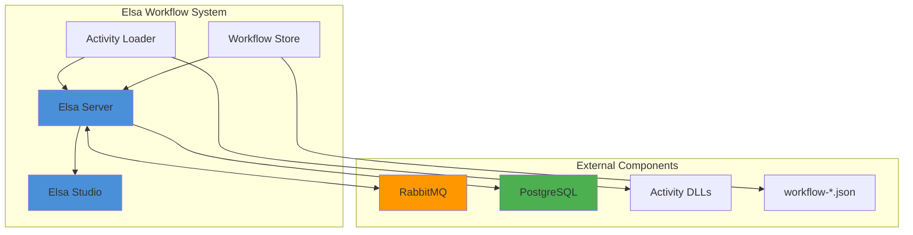
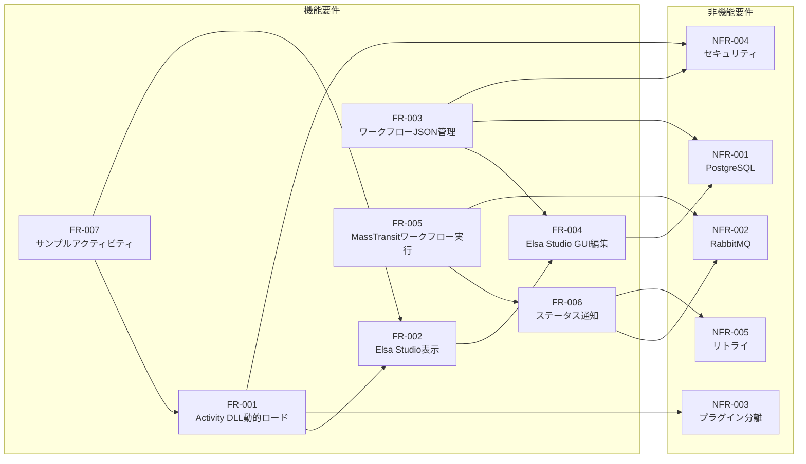

# Elsa Workflow System 要件定義書

## 1. プロジェクト概要

### 1.1 目的

Elsa Workflow Engine を拡張し、以下の機能を実現する統合ワークフロー実行基盤を構築する。

- **Activity DLL 動的ロード**: 指定ディレクトリからカスタムアクティビティDLLを動的に読み込み
- **JSON ワークフロー管理**: ファイルベースのワークフロー定義管理
- **MassTransit 連携**: メッセージ駆動によるワークフロー実行制御
- **Elsa Studio GUI 操作**: ビジュアルエディタによるワークフロー設計・編集

### 1.2 システム構成図

### 1.3 用語定義

| 用語 | 定義 |
|------|------|
| Activity | ワークフロー内で実行される単一の処理単位 |
| Workflow | 複数のActivityを組み合わせた処理フロー |
| Elsa Studio | ワークフローを視覚的に設計・編集するWebベースのGUI |
| MassTransit | .NET向けの分散アプリケーションフレームワーク（メッセージブローカー抽象化） |

---

## 2. 機能要件 (FR: Functional Requirements)

### FR-001: Activity DLL 動的ロード

| 項目 | 内容 |
|------|------|
| **要件ID** | FR-001 |
| **概要** | 指定ディレクトリからアクティビティDLLを読み込み、Elsa ランタイムに登録する |
| **詳細** | - 設定ファイルで指定されたディレクトリをスキャン - `IActivity` を実装したクラスを自動検出 - アプリケーション起動時およびホットリロード時にロード |
| **関連要件** | FR-002, NFR-003 |
| **受け入れ基準** | AC-001 |

### FR-002: Elsa Studio 表示

| 項目 | 内容 |
|------|------|
| **要件ID** | FR-002 |
| **概要** | ロードしたカスタムアクティビティが Elsa Studio のアクティビティ一覧に表示される |
| **詳細** | - カスタムアクティビティがカテゴリ別に整理表示 - アイコン・説明文の表示対応 - ドラッグ＆ドロップでワークフローに配置可能 |
| **関連要件** | FR-001, FR-004 |
| **受け入れ基準** | AC-002 |

### FR-003: ワークフローJSON管理

| 項目 | 内容 |
|------|------|
| **要件ID** | FR-003 |
| **概要** | `workflow-*.json` ファイルからワークフロー定義を読み込み・登録する |
| **詳細** | - 指定ディレクトリ内の `workflow-*.json` パターンのファイルを検出 - Elsaのワークフロー定義形式に準拠 - ファイル変更時の自動再読み込み対応 |
| **関連要件** | FR-004, NFR-001 |
| **受け入れ基準** | AC-003 |

### FR-004: Elsa Studio GUI編集

| 項目 | 内容 |
|------|------|
| **要件ID** | FR-004 |
| **概要** | Elsa Studio のビジュアルエディタでワークフロー JSON の編集・保存を行う |
| **詳細** | - ワークフローのビジュアル編集 - アクティビティのプロパティ設定 - 編集内容のJSON形式での永続化 - バージョン管理対応 |
| **関連要件** | FR-002, FR-003 |
| **受け入れ基準** | AC-004 |

### FR-005: MassTransit ワークフロー実行

| 項目 | 内容 |
|------|------|
| **要件ID** | FR-005 |
| **概要** | MassTransit メッセージ経由でワークフローの開始・停止を制御する |
| **詳細** | - `StartWorkflowCommand` メッセージでワークフロー開始 - `StopWorkflowCommand` メッセージでワークフロー停止 - ワークフローIDまたは定義名による指定 - 入力パラメータの受け渡し対応 |
| **関連要件** | FR-006, NFR-002 |
| **受け入れ基準** | AC-005 |

### FR-006: ワークフローステータス通知

| 項目 | 内容 |
|------|------|
| **要件ID** | FR-006 |
| **概要** | ワークフロー実行状態をMassTransit経由で通知する |
| **詳細** | - 対象ステータス: `Running`, `Suspended`, `Finished`, `Error` - ステータス変更時にイベントメッセージを発行 - エラー時は詳細情報を含む |
| **関連要件** | FR-005, NFR-005 |
| **受け入れ基準** | AC-006 |

### FR-007: サンプルカスタムアクティビティ

| 項目 | 内容 |
|------|------|
| **要件ID** | FR-007 |
| **概要** | DLLロードのサンプルとなるカスタムアクティビティテンプレートを提供する |
| **詳細** | - 基本的なアクティビティ実装サンプル - 入出力パラメータの定義例 - Elsa Studio表示用のメタデータ設定例 - 単体テストの実装例 |
| **関連要件** | FR-001, FR-002 |
| **受け入れ基準** | AC-007 |

---

## 3. 非機能要件 (NFR: Non-Functional Requirements)

### NFR-001: PostgreSQL データストア

| 項目 | 内容 |
|------|------|
| **要件ID** | NFR-001 |
| **概要** | データストアとしてPostgreSQLを使用する（SQLiteから移行） |
| **詳細** | - ワークフロー定義の永続化 - ワークフローインスタンスの状態管理 - 実行履歴の保存 - 接続プール管理 |
| **関連要件** | FR-003, FR-004 |

### NFR-002: RabbitMQ メッセージブローカー

| 項目 | 内容 |
|------|------|
| **要件ID** | NFR-002 |
| **概要** | MassTransitのトランスポートとしてRabbitMQを使用する |
| **詳細** | - メッセージの永続化 - 複数コンシューマー対応 - デッドレターキューの設定 - 接続のリトライ機構 |
| **関連要件** | FR-005, FR-006 |

### NFR-003: プラグイン分離

| 項目 | 内容 |
|------|------|
| **要件ID** | NFR-003 |
| **概要** | AssemblyLoadContext によるDLL分離ロードを実現する |
| **詳細** | - 各プラグインDLLを独立したコンテキストでロード - 依存関係の競合回避 - プラグインのアンロード対応 - メモリリーク防止 |
| **関連要件** | FR-001 |

### NFR-004: パス走査防止（セキュリティ）

| 項目 | 内容 |
|------|------|
| **要件ID** | NFR-004 |
| **概要** | ディレクトリトラバーサル攻撃を防止する |
| **詳細** | - 相対パス（`../`）の検出・拒否 - シンボリックリンクの制限 - 許可ディレクトリ外へのアクセス禁止 - 入力パスの正規化と検証 |
| **関連要件** | FR-001, FR-003 |

### NFR-005: リトライ機構

| 項目 | 内容 |
|------|------|
| **要件ID** | NFR-005 |
| **概要** | ステータス通知の再送機能を実装する |
| **詳細** | - 指数バックオフによるリトライ - 最大リトライ回数の設定 - デッドレターキューへの移動 - リトライ状況のログ出力 |
| **関連要件** | FR-006, NFR-002 |

---

## 4. 受け入れ基準 (AC: Acceptance Criteria)

各要件に対応するテスト項目を以下に定義する。

| AC ID | 要件ID | 受け入れ基準 | テスト項目 |
|-------|--------|--------------|-----------|
| AC-001 | FR-001 | 指定ディレクトリに配置したDLLからアクティビティを読み込めること | UT-001 |
| AC-002 | FR-002 | ロードしたカスタムアクティビティが Elsa Studio のアクティビティ一覧に表示されること | E2E-003 |
| AC-003 | FR-003 | `workflow-*.json` ファイルからワークフロー定義が正しく登録されること | UT-002 |
| AC-004 | FR-004 | Elsa Studio GUI でワークフローの編集・保存ができること | E2E-001, E2E-002 |
| AC-005 | FR-005 | MassTransit メッセージでワークフローの実行・停止ができること | UT-003, UT-004, IT-001 |
| AC-006 | FR-006 | ワークフローステータス（Running/Suspended/Finished/Error）がMassTransit経由で通知されること | UT-005 |
| AC-007 | FR-007 | サンプルカスタムアクティビティがビルド・テスト通過すること | UT-006 |

### 4.1 テスト項目一覧

#### 単体テスト (UT: Unit Test)

| テストID | 対象要件 | テスト概要 |
|----------|----------|-----------|
| UT-001 | FR-001 | Activity DLL Loaderが指定ディレクトリからDLLを正しくロードする |
| UT-002 | FR-003 | ワークフローJSONパーサーが定義を正しく解析・登録する |
| UT-003 | FR-005 | StartWorkflowCommandハンドラがワークフローを開始する |
| UT-004 | FR-005 | StopWorkflowCommandハンドラがワークフローを停止する |
| UT-005 | FR-006 | ワークフロー状態変更時に正しいステータスイベントが発行される |
| UT-006 | FR-007 | サンプルカスタムアクティビティが正常に動作する |

#### 結合テスト (IT: Integration Test)

| テストID | 対象要件 | テスト概要 |
|----------|----------|-----------|
| IT-001 | FR-005 | RabbitMQ経由のMassTransitメッセージでワークフローが実行される |

#### E2Eテスト (E2E: End-to-End Test)

| テストID | 対象要件 | テスト概要 |
|----------|----------|-----------|
| E2E-001 | FR-004 | Elsa Studioでワークフローを新規作成・保存できる |
| E2E-002 | FR-004 | Elsa Studioで既存ワークフローを編集・保存できる |
| E2E-003 | FR-002 | ロードしたカスタムアクティビティがElsa Studioに表示される |

---

## 5. 要件トレーサビリティマトリクス

---

## 6. 改訂履歴

| バージョン | 日付 | 変更内容 | 担当者 |
|-----------|------|----------|--------|
| 1.0 | 2026-02-20 | 初版作成 | - |
