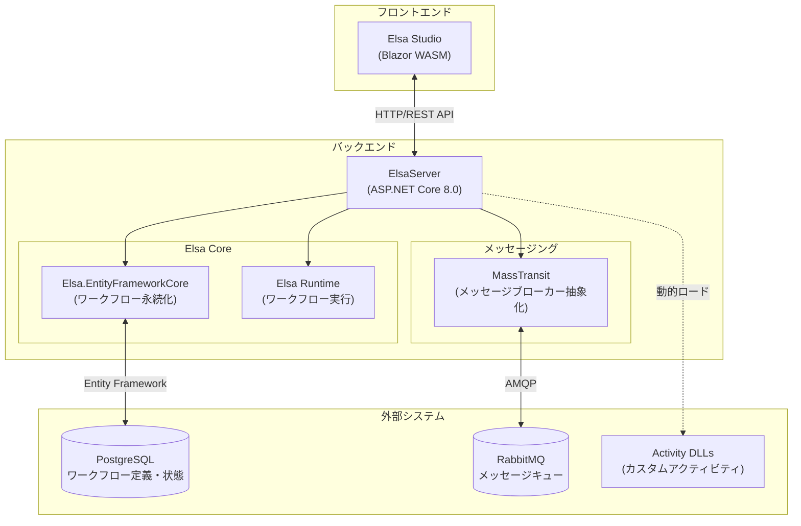
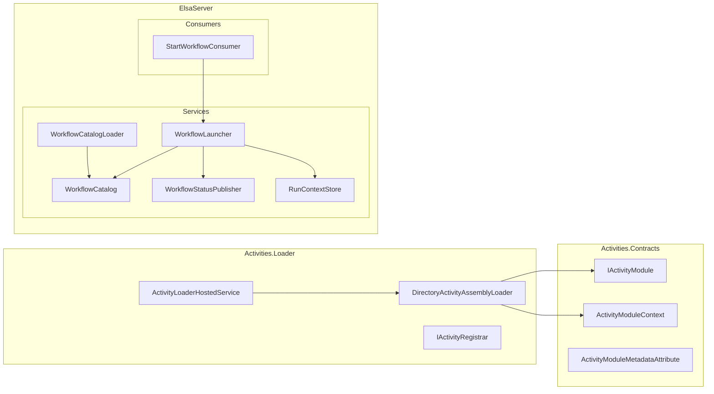
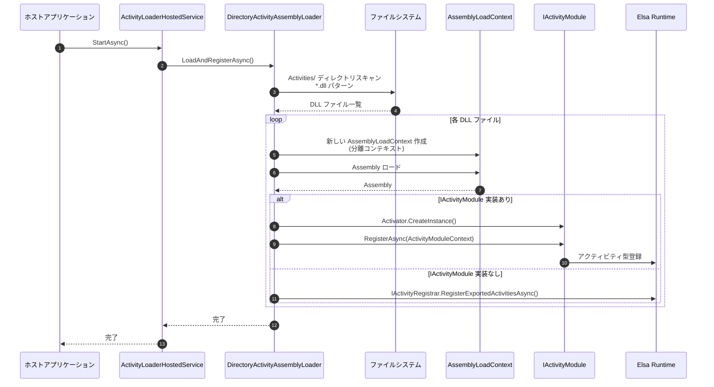
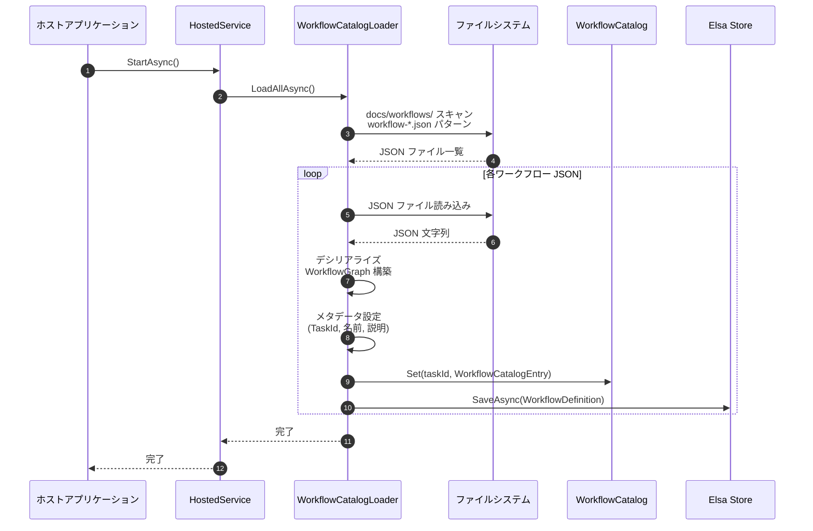
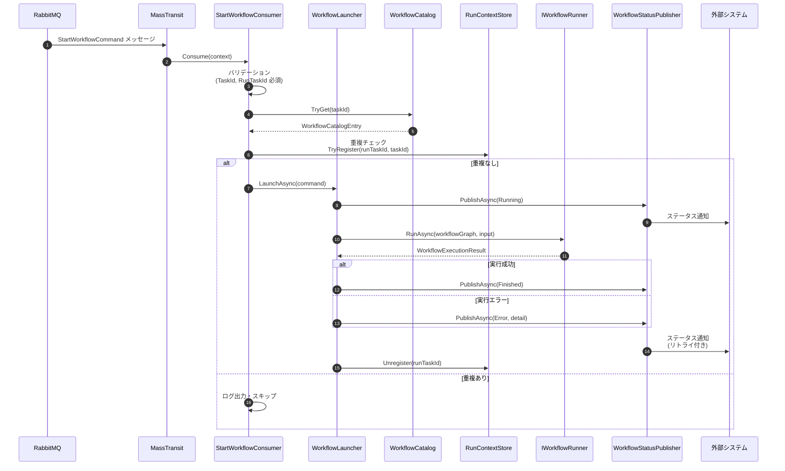
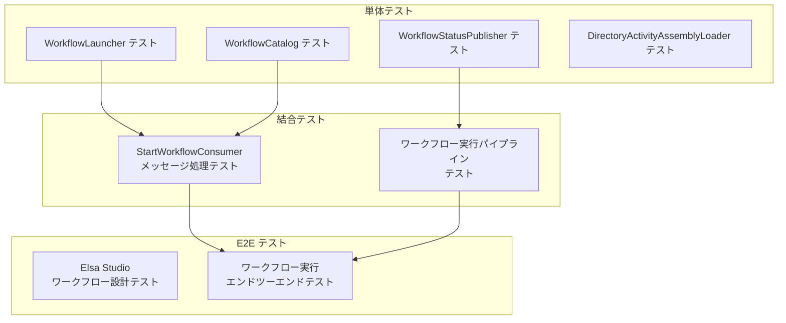

# Elsa Workflow System 基本設計書

## 1. システムアーキテクチャ概要

Elsa Workflow System は、Elsa 3.x をベースとしたワークフロー実行基盤です。Blazor WebAssembly による GUI（Elsa Studio）、ASP.NET Core による API サーバー（ElsaServer）、PostgreSQL によるデータ永続化、RabbitMQ によるメッセージングを組み合わせた分散アーキテクチャを採用しています。



### アーキテクチャの特徴

| 特徴 | 説明 |
|------|------|
| **プラグイン機構** | カスタムアクティビティを DLL として動的にロード可能 |
| **非同期メッセージング** | MassTransit + RabbitMQ によるワークフロー実行の非同期化 |
| **永続化** | PostgreSQL による ワークフロー定義・実行状態の永続化 |
| **GUI 管理** | Elsa Studio による ワークフローのビジュアル設計・監視 |

---

## 2. コンポーネント構成

システムは以下のプロジェクト・コンポーネントで構成されます。

| コンポーネント | プロジェクト | 責務 |
|--------------|------------|------|
| **アクティビティ契約** | `Activities.Contracts` | `IActivityModule` 等のインターフェース定義。カスタムアクティビティ DLL が実装すべき契約を提供 |
| **アクティビティローダー** | `Activities.Loader` | DLL 動的ロード・Elsa への登録を担当。`DirectoryActivityAssemblyLoader` が中核クラス |
| **サンプルアクティビティ** | `Activities.Templates.CustomActivityTemplate` | カスタムアクティビティ DLL プラグインのサンプル実装 |
| **ワークフローカタログ** | `WorkflowCatalog` | インメモリ ワークフロー定義レジストリ。`ConcurrentDictionary` で管理。`NagasakaEventSystem.WorkflowCatalog` 名前空間で独立ライブラリとして分離 |
| **ワークフロー起動** | `ElsaServer/Services/WorkflowLauncher` | ワークフロー実行のオーケストレーション。検証・実行・エラーハンドリング |
| **ステータス通知** | `ElsaServer/Services/WorkflowStatusPublisher` | ワークフロー実行状態の通知。リトライ機能付き |
| **メッセージ消費** | `ElsaServer/Consumers/StartWorkflowConsumer` | MassTransit コンシューマ。`StartWorkflowCommand` を受信してワークフロー実行 |

### コンポーネント依存関係



---

## 3. データフロー

### 3.1 DLL ロードフロー

アプリケーション起動時にカスタムアクティビティ DLL を動的にロードし、Elsa に登録します。



### 3.2 ワークフローロードフロー

起動時に JSON ファイルからワークフロー定義を読み込み、カタログに登録・DB に永続化します。



### 3.3 ワークフロー実行フロー

MassTransit 経由でメッセージを受信し、ワークフローを実行、ステータスを通知します。



---

## 4. 技術スタック

| カテゴリ | 技術 | バージョン | 用途 |
|---------|------|-----------|------|
| **ランタイム** | .NET | 8.0 | アプリケーション実行基盤 |
| **ワークフローエンジン** | Elsa | 3.5.2 | ワークフロー設計・実行・管理 |
| **データベース** | PostgreSQL | - | ワークフロー定義・実行状態の永続化 |
| **メッセージキュー** | RabbitMQ | - | 非同期メッセージング |
| **メッセージング抽象化** | MassTransit | - | メッセージブローカー抽象化レイヤー |
| **フロントエンド** | Blazor WebAssembly | - | Elsa Studio GUI |
| **ORM** | Entity Framework Core | - | PostgreSQL アクセス |

### 設定値（デフォルト）

| 項目 | 設定値 |
|------|--------|
| PostgreSQL 接続先 | `Host=localhost;Port=5432;Database=elsa_workflows` |
| RabbitMQ 接続先 | `localhost:5672` |
| ワークフローキュー名 | `workflow-start` |
| 同時処理数 | 8 |
| プリフェッチ数 | 16 |
| ステータス通知リトライ | 3回、2秒間隔 |
| ワークフロー定義ディレクトリ | `docs/workflows/` |
| カスタムアクティビティディレクトリ | `Activities/` |

---

## 5. テスト方針

### テスト種別と実行方法

| テスト種別 | フレームワーク | 対象 | 実行方法 |
|-----------|--------------|------|---------|
| **単体テスト** | xUnit + Moq + FluentAssertions | 各サービスクラス (`WorkflowLauncher`, `WorkflowCatalog` 等) | `dotnet test --filter "Category!=E2E"` |
| **結合テスト** | xUnit + MassTransit.Testing | MassTransit パイプライン (`StartWorkflowConsumer` 等) | `dotnet test --filter "Category!=E2E"` |
| **E2E テスト** | xUnit + Microsoft.Playwright | Elsa Studio GUI 操作 | `dotnet test --filter "Category=E2E"` |

### テスト戦略



### テスト観点

| テスト種別 | 主な観点 |
|-----------|---------|
| **単体テスト** | メソッド単位の動作検証、境界値テスト、例外処理、モック活用 |
| **結合テスト** | MassTransit メッセージフロー、コンシューマ連携、サービス間連携 |
| **E2E テスト** | ユーザー操作シナリオ、GUI 動作検証、ワークフロー実行確認 |

---

## 6. 主要クラス詳細

### 6.1 Activities.Contracts

#### IActivityModule

カスタムアクティビティ DLL が実装するエントリポイントインターフェース。

```csharp
public interface IActivityModule
{
    ValueTask RegisterAsync(ActivityModuleContext context, CancellationToken cancellationToken);
}
```

#### ActivityModuleContext

`IActivityModule.RegisterAsync()` に渡されるコンテキスト。DI コンテナへのアクセスを提供。

```csharp
public sealed record ActivityModuleContext(IServiceProvider Services);
```

#### ActivityModuleMetadataAttribute

アセンブリレベルで適用するメタデータ属性。

```csharp
[AttributeUsage(AttributeTargets.Assembly)]
public sealed class ActivityModuleMetadataAttribute : Attribute
{
    public ActivityModuleMetadataAttribute(string name, string version);
    public string? Description { get; init; }
}
```

### 6.2 Activities.Loader

#### DirectoryActivityAssemblyLoader

DLL 動的ロードの中核クラス。

| メソッド | 説明 |
|---------|------|
| `LoadAndRegisterAsync()` | 指定ディレクトリから DLL を検索・ロード・登録 |

**特徴:**
- 各 DLL を独立した `AssemblyLoadContext` でロード（分離）
- `Resolving` イベントで依存関係を解決
- `IActivityModule` 実装があれば優先的に使用
- パストラバーサル攻撃を防止

### 6.3 ElsaServer/Services

#### WorkflowCatalog

ワークフロー定義のインメモリレジストリ。

| メソッド | 説明 |
|---------|------|
| `Set(taskId, entry)` | ワークフローエントリを登録 |
| `TryGet(taskId, out entry)` | TaskId でワークフローを取得 |
| `List()` | 全ワークフロー一覧を取得 |

#### WorkflowLauncher

ワークフロー実行のオーケストレーター。

| メソッド | 説明 |
|---------|------|
| `LaunchAsync(command)` | `StartWorkflowCommand` からワークフローを実行 |

**処理フロー:**
1. TaskId/RunTaskId のバリデーション
2. カタログからワークフロー検索
3. 実行コンテキスト登録
4. ペイロードをワークフロー入力にマッピング
5. `IWorkflowRunner` で実行
6. ステータス通知（成功/エラー）

#### WorkflowStatusPublisher

ワークフロー実行ステータスの通知を担当。

| メソッド | 説明 |
|---------|------|
| `PublishAsync(taskId, runTaskId, status, detail)` | ステータス更新を通知 |
| `PublishWithRetryAsync()` | リトライ付きで通知 |

**ステータス種別:** `Running`, `Suspended`, `Error`, `Finished`

### 6.4 ElsaServer/Consumers

#### StartWorkflowConsumer

MassTransit コンシューマ。`StartWorkflowCommand` メッセージを処理。

**メッセージ構造:**

```csharp
public record StartWorkflowCommand
{
    public string TaskId { get; init; }
    public string RunTaskId { get; init; }
    public Dictionary<string, object?> Payload { get; init; }
    public Dictionary<string, string>? Headers { get; init; }
}
```

**処理フロー:**
1. ロギング
2. TaskId/RunTaskId バリデーション
3. カタログ存在確認
4. 重複実行チェック
5. ワークフロー実行
6. エラーハンドリング・ステータス通知

---

## 7. 設定オプション

### WorkflowBusOptions

MassTransit/RabbitMQ 設定。

| プロパティ | 説明 | デフォルト |
|-----------|------|-----------|
| `QueueName` | ワークフロー起動キュー名 | `workflow-start` |
| `ConcurrentMessageLimit` | 同時処理メッセージ数 | 8 |
| `PrefetchCount` | プリフェッチ数 | 16 |

### WorkflowCatalogOptions

ワークフローカタログ設定。

| プロパティ | 説明 | デフォルト |
|-----------|------|-----------|
| `Directory` | ワークフロー JSON ディレクトリ | `docs/workflows` |
| `Strict` | 厳格モード | true |

### ActivityLoaderOptions

アクティビティローダー設定。

| プロパティ | 説明 | デフォルト |
|-----------|------|-----------|
| `Directory` | DLL ディレクトリ | `Activities` |
| `SearchPattern` | 検索パターン | `*.dll` |
| `Recursive` | 再帰検索 | false |
| `Strict` | 厳格モード | false |
