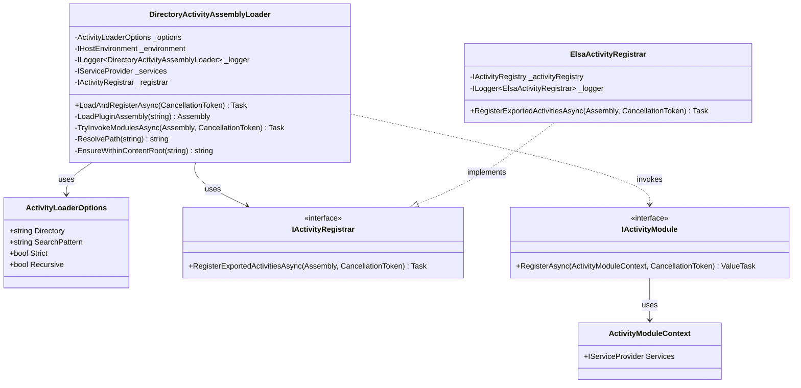
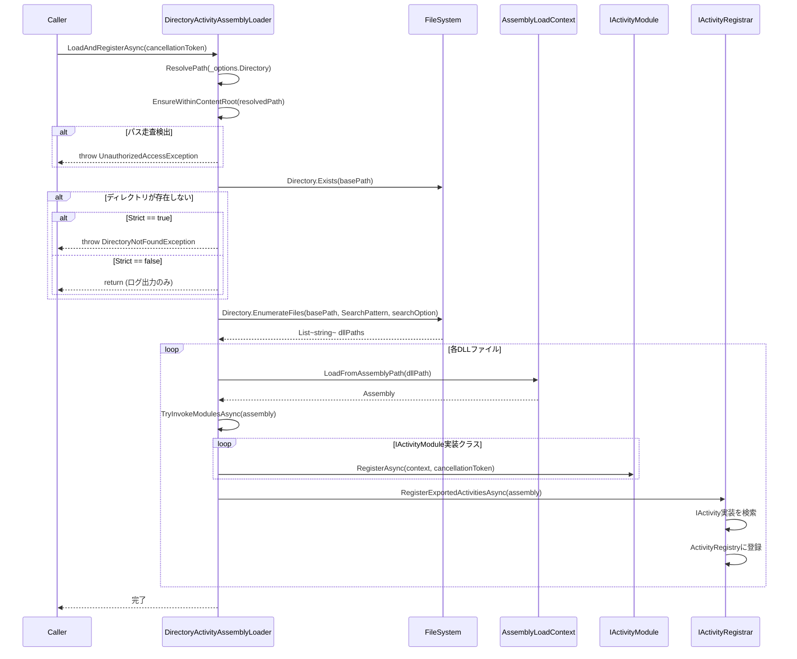
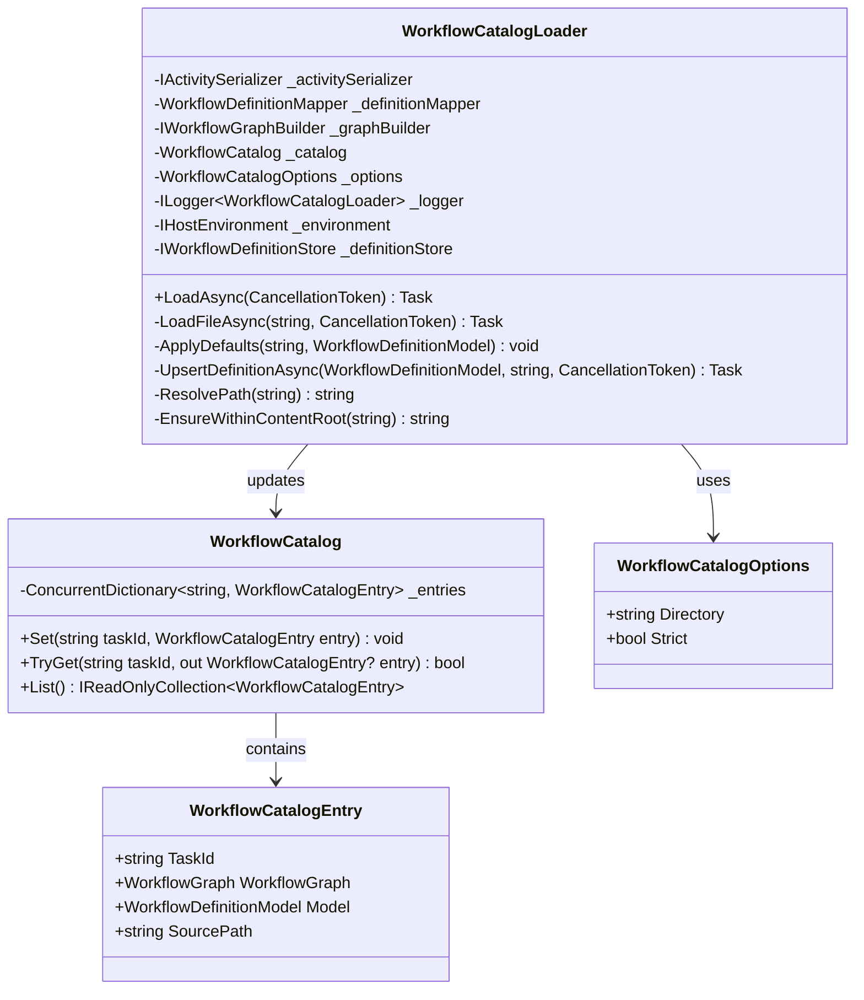
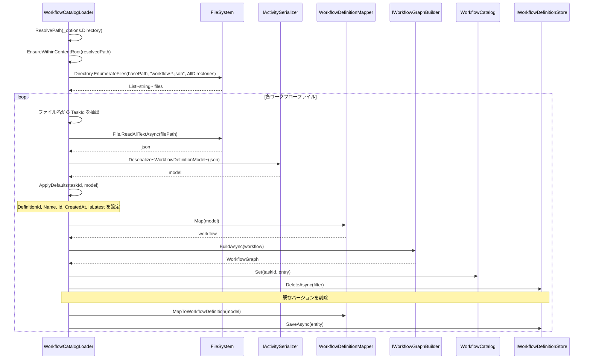
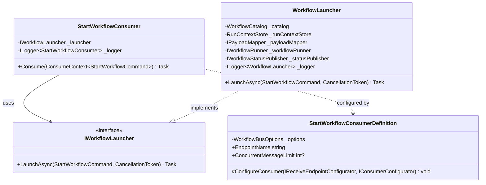
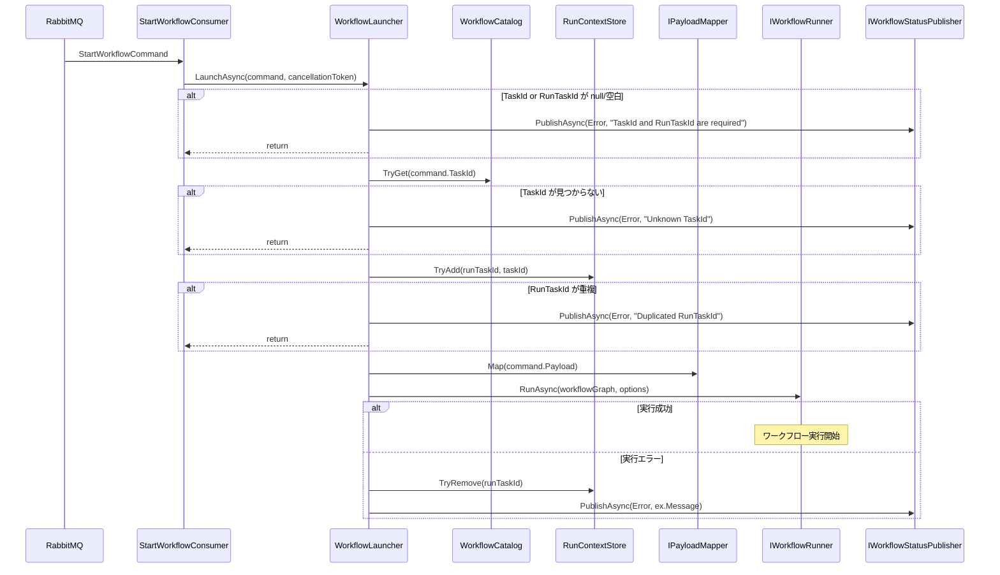
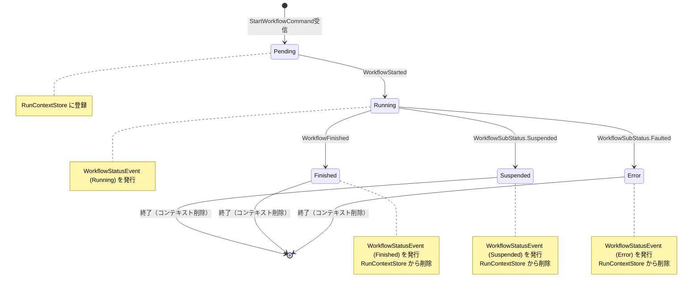

# Elsa Workflow System 詳細設計書

## 1. 概要

本ドキュメントは、Elsa Workflow System の詳細設計を記載する。システムは以下の主要コンポーネントで構成される：

- **Activity DLL ローダー**: 外部アクティビティアセンブリの動的ロードと登録
- **ワークフローカタログ**: JSONファイルベースのワークフロー定義管理
- **MassTransit連携**: RabbitMQを介したメッセージングによるワークフロー実行制御
- **データベース**: PostgreSQLによる永続化

---

## 2. Activity DLL ローダー詳細設計

### 2.1 クラス図



### 2.2 シーケンス図：LoadAndRegisterAsync 処理フロー



### 2.3 パス走査防止: EnsureWithinContentRoot の検証ロジック

`EnsureWithinContentRoot` メソッドは、パストラバーサル攻撃を防止するためのセキュリティ検証を行う。

```csharp
private string EnsureWithinContentRoot(string resolvedPath)
{
    var root = Path.GetFullPath(_environment.ContentRootPath);
    var parentRoot = Path.GetFullPath(Path.Combine(root, "..", ".."));
    var fullPath = Path.GetFullPath(resolvedPath);
    
    if (!fullPath.StartsWith(root, StringComparison.OrdinalIgnoreCase) &&
        !fullPath.StartsWith(parentRoot, StringComparison.OrdinalIgnoreCase))
        throw new UnauthorizedAccessException(
            $"Path traversal detected: {resolvedPath} is outside allowed directories.");
    
    return fullPath;
}
```

**検証ロジック:**

| チェック項目 | 説明 |
|-------------|------|
| ContentRootPath 内 | アプリケーションのコンテンツルート配下であることを確認 |
| 親2階層まで許可 | `ContentRootPath/../..` までのパスを許可（開発環境対応） |
| 絶対パス変換 | `Path.GetFullPath()` で相対パスを解決し、`../` による脱出を検出 |
| 大文字小文字無視 | Windows環境を考慮した比較 |

### 2.4 設定項目: ActivityLoaderOptions

| プロパティ | 型 | デフォルト値 | 説明 |
|-----------|-----|-------------|------|
| `Directory` | `string` | `"Activities"` | アクティビティDLLを検索するディレクトリ |
| `SearchPattern` | `string` | `"*.dll"` | 検索パターン（glob形式） |
| `Strict` | `bool` | `false` | true: エラー時に例外をスロー、false: 警告ログのみ |
| `Recursive` | `bool` | `false` | true: サブディレクトリも再帰的に検索 |

### 2.5 AssemblyLoadContext による依存解決

プラグインDLLの依存関係は、専用の `AssemblyLoadContext` で解決される：

```csharp
var loadContext = new AssemblyLoadContext(
    $"Activities:{Path.GetFileNameWithoutExtension(assemblyPath)}", 
    isCollectible: false
);

loadContext.Resolving += (_, name) =>
{
    var candidate = Path.Combine(
        Path.GetDirectoryName(assemblyPath)!, 
        $"{name.Name}.dll"
    );
    return File.Exists(candidate) 
        ? loadContext.LoadFromAssemblyPath(candidate) 
        : null;
};
```

**特徴:**
- 各プラグインは独立した `AssemblyLoadContext` を持つ
- 依存DLLはプラグインDLLと同じディレクトリから解決
- `isCollectible: false` によりアンロード不可（パフォーマンス優先）

---

## 3. ワークフローカタログ詳細設計

### 3.1 クラス図



### 3.2 JSONファイル命名規則

ワークフロー定義ファイルは以下の命名規則に従う：

```
workflow-{taskId}.json
```

**正規表現パターン:**
```csharp
private static readonly Regex FileNamePattern = 
    new("^workflow-(?<taskId>[a-zA-Z0-9_-]+)\\.json$", RegexOptions.Compiled);
```

**TaskID許可文字:**
- 英大文字: `A-Z`
- 英小文字: `a-z`
- 数字: `0-9`
- アンダースコア: `_`
- ハイフン: `-`

**ファイル例:**
- `workflow-order-processing.json` → TaskId: `order-processing`
- `workflow-user_notification.json` → TaskId: `user_notification`
- `workflow-batch001.json` → TaskId: `batch001`

### 3.3 ロード処理フロー



### 3.4 ApplyDefaults 処理

ワークフロー定義モデルにデフォルト値を適用する：

```csharp
private void ApplyDefaults(string taskId, WorkflowDefinitionModel model)
{
    model.DefinitionId = string.IsNullOrWhiteSpace(model.DefinitionId) 
        ? taskId 
        : model.DefinitionId.Trim();
    model.Name ??= taskId;
    model.Id ??= $"{model.DefinitionId}-v{model.Version}";
    model.CreatedAt = model.CreatedAt == default 
        ? DateTimeOffset.UtcNow 
        : model.CreatedAt;
    model.IsLatest = true;
}
```

| フィールド | デフォルト値 | 説明 |
|-----------|-------------|------|
| `DefinitionId` | TaskId | 未設定の場合、ファイル名から抽出したTaskIdを使用 |
| `Name` | TaskId | 未設定の場合、TaskIdを使用 |
| `Id` | `{DefinitionId}-v{Version}` | 未設定の場合、自動生成 |
| `CreatedAt` | `DateTimeOffset.UtcNow` | 未設定の場合、現在時刻 |
| `IsLatest` | `true` | 常に最新バージョンとしてマーク |

### 3.5 パス走査防止ロジック

`WorkflowCatalogLoader` も `DirectoryActivityAssemblyLoader` と同様の `EnsureWithinContentRoot` を実装：

```csharp
private string EnsureWithinContentRoot(string resolvedPath)
{
    var root = Path.GetFullPath(_environment.ContentRootPath);
    var parentRoot = Path.GetFullPath(Path.Combine(root, "..", ".."));
    var fullPath = Path.GetFullPath(resolvedPath);
    
    if (!fullPath.StartsWith(root, StringComparison.OrdinalIgnoreCase) &&
        !fullPath.StartsWith(parentRoot, StringComparison.OrdinalIgnoreCase))
        throw new UnauthorizedAccessException(
            $"Path traversal detected: {resolvedPath} is outside allowed directories.");
    
    return fullPath;
}
```

### 3.6 設定項目: WorkflowCatalogOptions

| プロパティ | 型 | デフォルト値 | 説明 |
|-----------|-----|-------------|------|
| `Directory` | `string` | `"docs/workflows"` | ワークフロー定義JSONを検索するディレクトリ |
| `Strict` | `bool` | `true` | true: エラー時に例外をスロー、false: 警告ログのみ |

---

## 4. MassTransit連携詳細設計

### 4.1 メッセージ定義

#### StartWorkflowCommand

ワークフロー実行開始を要求するコマンドメッセージ。

```csharp
[DisplayName("StartWorkflowCommand")]
public class StartWorkflowCommand
{
    public string TaskId { get; set; } = string.Empty;
    public string RunTaskId { get; set; } = string.Empty;
    public IDictionary<string, object>? Payload { get; set; }
        = new Dictionary<string, object>(StringComparer.OrdinalIgnoreCase);
    public IDictionary<string, string>? Headers { get; set; }
        = new Dictionary<string, string>(StringComparer.OrdinalIgnoreCase);
}
```

| プロパティ | 型 | 必須 | 説明 |
|-----------|-----|-----|------|
| `TaskId` | `string` | ✓ | ワークフロー定義の識別子 |
| `RunTaskId` | `string` | ✓ | 実行インスタンスの一意識別子（CorrelationId） |
| `Payload` | `IDictionary<string, object>?` | - | ワークフロー入力パラメータ |
| `Headers` | `IDictionary<string, string>?` | - | メタデータヘッダー（将来拡張用） |

#### WorkflowStatusEvent

ワークフロー状態変更を通知するイベントメッセージ。

```csharp
[DisplayName("WorkflowStatusEvent")]
public class WorkflowStatusEvent
{
    public string TaskId { get; set; } = string.Empty;
    public string RunTaskId { get; set; } = string.Empty;
    public WorkflowStatusKind Status { get; set; } = WorkflowStatusKind.Running;
    public string? Detail { get; set; } = string.Empty;
    public DateTimeOffset OccurredAtUtc { get; set; } = DateTimeOffset.UtcNow;
}

public enum WorkflowStatusKind
{
    Running,
    Suspended,
    Finished,
    Error
}
```

| プロパティ | 型 | 説明 |
|-----------|-----|------|
| `TaskId` | `string` | ワークフロー定義の識別子 |
| `RunTaskId` | `string` | 実行インスタンスの一意識別子 |
| `Status` | `WorkflowStatusKind` | 現在のワークフロー状態 |
| `Detail` | `string?` | 状態に関する詳細情報（エラーメッセージ等） |
| `OccurredAtUtc` | `DateTimeOffset` | 状態変更発生時刻（UTC） |

### 4.2 Consumer クラス図



### 4.3 メッセージ処理シーケンス



### 4.4 状態遷移図



### 4.5 WorkflowStatusPublisher の通知ハンドリング

`WorkflowStatusPublisher` は Elsa の通知システムと統合される：

| 通知 | ハンドラメソッド | 発行ステータス |
|-----|-----------------|---------------|
| `WorkflowStarted` | `HandleAsync(WorkflowStarted)` | `Running` |
| `WorkflowExecuted` (Suspended) | `HandleAsync(WorkflowExecuted)` | `Suspended` |
| `WorkflowExecuted` (Faulted) | `HandleAsync(WorkflowExecuted)` | `Error` |
| `WorkflowFinished` | `HandleAsync(WorkflowFinished)` | `Finished` |

### 4.6 リトライ設定

ステータス発行時のリトライ動作は `WorkflowBusOptions` で制御される：

| 設定項目 | デフォルト値 | 説明 |
|---------|-------------|------|
| `StatusPublishRetryCount` | `3` | リトライ最大回数 |
| `StatusPublishRetryDelaySeconds` | `2` | リトライ間隔（秒） |

**リトライロジック:**

```csharp
private async Task PublishWithRetryAsync(WorkflowStatusEvent message, CancellationToken cancellationToken)
{
    var attempts = Math.Max(1, _options.StatusPublishRetryCount);
    for (var i = 1; i <= attempts; i++)
    {
        try
        {
            await _publishEndpoint.Publish(message, cancellationToken);
            return;
        }
        catch (Exception ex) when (i < attempts)
        {
            _logger.LogWarning(ex, 
                "Failed to publish status event (attempt {Attempt}/{Attempts})", i, attempts);
            await Task.Delay(
                TimeSpan.FromSeconds(_options.StatusPublishRetryDelaySeconds), 
                cancellationToken);
        }
        catch (Exception ex)
        {
            _logger.LogError(ex, 
                "Final attempt to publish status event failed (attempt {Attempt}/{Attempts})", i, attempts);
            throw;
        }
    }
}
```

### 4.7 入力検証

`WorkflowLauncher.LaunchAsync` での入力検証：

```csharp
if (string.IsNullOrWhiteSpace(command.TaskId) || 
    string.IsNullOrWhiteSpace(command.RunTaskId))
{
    _logger.LogWarning("Invalid command: TaskId or RunTaskId is null/empty");
    await _statusPublisher.PublishAsync(
        command.TaskId ?? "", 
        command.RunTaskId ?? "", 
        WorkflowStatusKind.Error, 
        "TaskId and RunTaskId are required", 
        cancellationToken);
    return;
}
```

| 検証項目 | 条件 | エラーメッセージ |
|---------|------|----------------|
| TaskId | null または 空白 | `"TaskId and RunTaskId are required"` |
| RunTaskId | null または 空白 | `"TaskId and RunTaskId are required"` |
| TaskId 存在確認 | カタログに未登録 | `"Unknown TaskId"` |
| RunTaskId 重複確認 | RunContextStoreに既存 | `"Duplicated RunTaskId"` |

---

## 5. データベース設計

### 5.1 PostgreSQL接続設定

```json
{
  "ConnectionStrings": {
    "PostgreSQL": "Host=localhost;Port=5432;Database=elsa_workflows;Username=elsa_user;Password=elsa_password"
  }
}
```

| パラメータ | デフォルト値 | 説明 |
|-----------|-------------|------|
| Host | `localhost` | PostgreSQLサーバーホスト |
| Port | `5432` | PostgreSQLポート |
| Database | `elsa_workflows` | データベース名 |
| Username | `elsa_user` | 接続ユーザー |
| Password | `elsa_password` | 接続パスワード |

### 5.2 Elsa EFCore テーブル

Elsa が自動生成する主要テーブル：

| テーブル名 | 説明 |
|-----------|------|
| `WorkflowDefinitions` | ワークフロー定義を格納 |
| `WorkflowInstances` | ワークフロー実行インスタンスを格納 |
| `ActivityExecutionRecords` | アクティビティ実行履歴 |
| `WorkflowBookmarks` | サスペンド時のブックマーク情報 |
| `WorkflowInboxMessages` | 受信メッセージキュー |
| `StoredTriggers` | トリガー情報 |

### 5.3 Elsa EFCore 設定

```csharp
services
    .AddElsa(elsa => elsa
        .UseWorkflowManagement(management => 
            management.UseEntityFrameworkCore(ef => 
                ef.UsePostgreSql(postgresConnectionString)))
        .UseWorkflowRuntime(runtime => 
            runtime.UseEntityFrameworkCore(ef => 
                ef.UsePostgreSql(postgresConnectionString)))
    );
```

### 5.4 マイグレーション

Elsa は `RunMigrationsAsync` による自動マイグレーションをサポート。スタートアップ時に `StartupInitializationHostedService` で実行される。

---

## 6. 設定項目一覧

### 6.1 appsettings.json 全体構造

```json
{
  "Logging": { ... },
  "AllowedHosts": "*",
  "Http": { ... },
  "ConnectionStrings": { ... },
  "MassTransit": { ... },
  "WorkflowCatalog": { ... },
  "Activities": { ... },
  "WorkflowMessaging": { ... }
}
```

### 6.2 設定項目詳細

#### Logging セクション

| キー | 型 | デフォルト値 | 説明 |
|-----|-----|-------------|------|
| `Logging:LogLevel:Default` | `string` | `"Information"` | デフォルトログレベル |
| `Logging:LogLevel:Microsoft.AspNetCore` | `string` | `"Warning"` | ASP.NETログレベル |

#### Http セクション

| キー | 型 | デフォルト値 | 説明 |
|-----|-----|-------------|------|
| `Http:BaseUrl` | `string` | `"https://localhost:5001"` | サーバーのベースURL |
| `Http:BasePath` | `string` | `"/api/workflows"` | APIのベースパス |

#### ConnectionStrings セクション

| キー | 型 | デフォルト値 | 説明 |
|-----|-----|-------------|------|
| `ConnectionStrings:PostgreSQL` | `string` | （下記参照） | PostgreSQL接続文字列 |

デフォルト接続文字列:
```
Host=localhost;Port=5432;Database=elsa_workflows;Username=elsa_user;Password=elsa_password
```

#### MassTransit セクション

| キー | 型 | デフォルト値 | 説明 |
|-----|-----|-------------|------|
| `MassTransit:Host` | `string` | `"localhost"` | RabbitMQホスト |
| `MassTransit:Port` | `int` | `5672` | RabbitMQポート |
| `MassTransit:VirtualHost` | `string` | `"/"` | 仮想ホスト |
| `MassTransit:Username` | `string` | `"guest"` | 認証ユーザー名 |
| `MassTransit:Password` | `string` | `"guest"` | 認証パスワード |

#### WorkflowCatalog セクション

| キー | 型 | デフォルト値 | 説明 |
|-----|-----|-------------|------|
| `WorkflowCatalog:Directory` | `string` | `"docs/workflows"` | ワークフロー定義の検索ディレクトリ |
| `WorkflowCatalog:Strict` | `bool` | `true` | エラー時に例外をスローするか |

#### Activities セクション

| キー | 型 | デフォルト値 | 説明 |
|-----|-----|-------------|------|
| `Activities:Directory` | `string` | `"Activities"` | アクティビティDLLの検索ディレクトリ |
| `Activities:SearchPattern` | `string` | `"*.dll"` | 検索パターン |
| `Activities:Strict` | `bool` | `false` | エラー時に例外をスローするか |

#### WorkflowMessaging セクション

| キー | 型 | デフォルト値 | 説明 |
|-----|-----|-------------|------|
| `WorkflowMessaging:StartQueueName` | `string` | `"workflow-start"` | ワークフロー開始コマンドのキュー名 |
| `WorkflowMessaging:PrefetchCount` | `ushort` | `16` | プリフェッチ数 |
| `WorkflowMessaging:ConcurrentMessageLimit` | `int?` | `8` | 同時処理メッセージ数上限 |
| `WorkflowMessaging:StatusPublishRetryCount` | `int` | `3` | ステータス発行リトライ回数 |
| `WorkflowMessaging:StatusPublishRetryDelaySeconds` | `int` | `2` | リトライ間隔（秒） |

---

## 7. サービス登録一覧

### 7.1 DI コンテナ登録

| サービス | 実装 | ライフタイム | 説明 |
|---------|------|-------------|------|
| `RunContextStore` | - | Singleton | 実行中ワークフローのコンテキスト管理 |
| `WorkflowCatalog` | - | Singleton | ワークフロー定義のインメモリカタログ |
| `WorkflowCatalogLoader` | - | Scoped | ワークフロー定義のファイルロード |
| `ActivityAssemblyLoader` | - | Scoped | アクティビティアセンブリのロード |
| `IActivityRegistrar` | `ElsaActivityRegistrar` | Scoped | Elsaへのアクティビティ登録 |
| `DirectoryActivityAssemblyLoader` | - | Scoped | ディレクトリからのDLLロード |
| `IPayloadMapper` | `DefaultPayloadMapper` | Singleton | ペイロードマッピング |
| `IWorkflowLauncher` | `WorkflowLauncher` | Scoped | ワークフロー実行起動 |
| `WorkflowStatusPublisher` | - | Scoped | ステータスイベント発行 |
| `IWorkflowStatusPublisher` | `WorkflowStatusPublisher` | Scoped | ステータス発行インターフェース |
| `INotificationHandler<WorkflowStarted>` | `WorkflowStatusPublisher` | Scoped | 開始通知ハンドラ |
| `INotificationHandler<WorkflowExecuted>` | `WorkflowStatusPublisher` | Scoped | 実行通知ハンドラ |
| `INotificationHandler<WorkflowFinished>` | `WorkflowStatusPublisher` | Scoped | 完了通知ハンドラ |

---

## 8. セキュリティ考慮事項

### 8.1 パストラバーサル対策

- `EnsureWithinContentRoot` による許可ディレクトリ外アクセス防止
- 絶対パス変換による相対パス攻撃の検出

### 8.2 入力検証

- `TaskId` / `RunTaskId` の null/空白チェック
- ファイル名の正規表現によるバリデーション
- 重複実行防止（`RunContextStore`）

### 8.3 認証・認可

- JWT トークンベースの認証（Elsa Identity）
- 管理者ユーザープロバイダーの使用

---

## 9. 付録

### 9.1 名前空間一覧

| 名前空間 | 説明 |
|---------|------|
| `NagasakaEventSystem.Activities.Loader` | アクティビティローダー関連 |
| `NagasakaEventSystem.Activities.Contracts` | アクティビティモジュール契約 |
| `ElsaServer.Services` | ワークフローサービス実装 |
| `ElsaServer.Options` | 設定オプションクラス |
| `ElsaServer.Consumers` | MassTransit Consumer |
| `ElsaServer.Messages` | メッセージ定義 |
| `ElsaServer.Hosted` | HostedService 実装 |

### 9.2 定数定義

```csharp
// WorkflowPropertyKeys.cs
public static class WorkflowPropertyKeys
{
    public const string TaskId = "TaskId";
    public const string RunTaskId = "RunTaskId";
}
```
