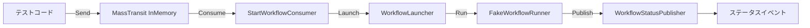
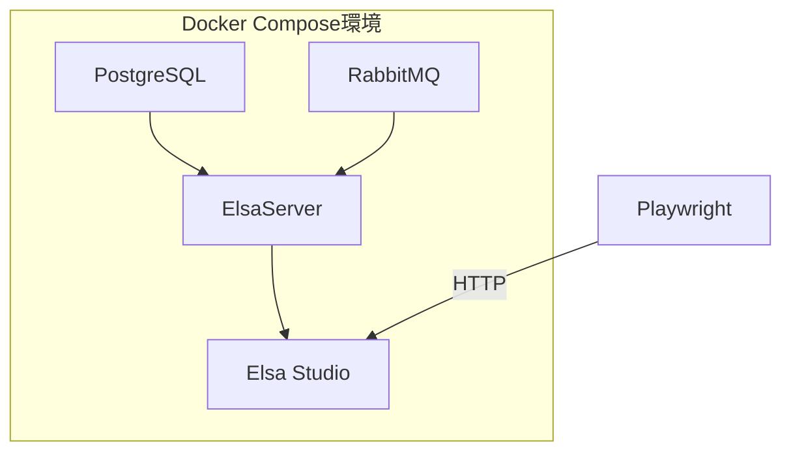

# テスト仕様書

## 概要

本ドキュメントは Elsa Workflow System のテスト仕様を定義します。テストは以下の3種類に分類されます：

- **単体テスト (UT)**: 個々のコンポーネントを独立してテスト
- **結合テスト (IT)**: 複数コンポーネント間の連携をテスト
- **E2Eテスト (E2E)**: 実環境でのエンドツーエンドテスト

## 1. テスト一覧（要件トレーサビリティマトリクス）

| テストID | テスト種別 | テスト名 | 対象要件 | テストファイル |
|---------|-----------|---------|---------|---------------|
| UT-001 | 単体 | Loads_Dlls_From_Directory_And_Registers_Activities | FR-001 | Activities.Loader.UnitTests/DirectoryActivityAssemblyLoaderTests.cs |
| UT-002 | 単体 | Map_Copies_With_OrdinalIgnoreCase | FR-005 | DefaultPayloadMapperTests.cs |
| UT-002b | 単体 | Map_Returns_Empty_Dictionary_When_Null | FR-005 | DefaultPayloadMapperTests.cs |
| UT-003 | 単体 | Launches_Workflow_With_Correlation_And_Properties | FR-005 | WorkflowLauncherTests.cs |
| UT-004 | 単体 | Unknown_TaskId_Publishes_Error | FR-005 | WorkflowLauncherTests.cs |
| UT-004b | 単体 | Duplicate_RunTaskId_Publishes_Error | FR-005 | WorkflowLauncherTests.cs |
| UT-005 | 単体 | PublishAsync_Sends_Status_Event | FR-006 | WorkflowStatusPublisherTests.cs |
| UT-006a | 単体 | Executes_And_Sets_Result | FR-007 | SampleCustomActivityTests.cs |
| UT-007a | 単体 | TryAdd_Allows_First_Entry | NFR-003 | RunContextStoreTests.cs |
| UT-007b | 単体 | TryAdd_Denies_Duplicate_RunTaskId | NFR-003 | RunContextStoreTests.cs |
| UT-007c | 単体 | TryRemove_Removes_And_Returns_TaskId | NFR-003 | RunContextStoreTests.cs |
| UT-008 | 単体 | Consume_Invokes_WorkflowLauncher | FR-005 | StartWorkflowConsumerTests.cs |
| UT-009 | 単体 | Set_AddsEntryToCatalog | FR-008 | WorkflowCatalog.UnitTests/WorkflowCatalogTests.cs |
| UT-010 | 単体 | TryGet_ReturnsFalse_WhenTaskIdNotFound | FR-008 | WorkflowCatalog.UnitTests/WorkflowCatalogTests.cs |
| UT-011 | 単体 | TryGet_IsCaseInsensitive | FR-008 | WorkflowCatalog.UnitTests/WorkflowCatalogTests.cs |
| UT-012 | 単体 | Remove_RemovesEntryFromCatalog | FR-008 | WorkflowCatalog.UnitTests/WorkflowCatalogTests.cs |
| UT-013 | 単体 | List_ReturnsAllEntries | FR-008 | WorkflowCatalog.UnitTests/WorkflowCatalogTests.cs |
| UT-014 | 単体 | FileNamePattern_MatchesValidWorkflowFiles | FR-008 | WorkflowCatalog.UnitTests/WorkflowCatalogLoaderTests.cs |
| IT-001 | 結合 | StartWorkflowCommand_Publishes_Status_Events | FR-005, FR-006 | StartWorkflowIntegrationTests.cs |
| IT-002 | 結合 | LoadAndRegister_CustomActivityTemplate_RegistersIActivityModule | FR-001 | Activities.Loader.IntegrationTests/ActivityLoadAndRegisterTests.cs |
| IT-003 | 結合 | TestDataFile_ContainsValidJson | FR-008 | WorkflowCatalog.IntegrationTests/WorkflowCatalogLoadTests.cs |
| E2E-001 | E2E | Can_Login_To_ElsaStudio | FR-004 | ElsaStudioLoginTests.cs |
| E2E-002 | E2E | Can_Navigate_To_Workflow_Definitions | FR-004 | WorkflowEditorTests.cs |
| E2E-002b | E2E | Can_Create_New_Workflow | FR-004 | WorkflowEditorTests.cs |
| E2E-003 | E2E | Can_View_Activity_Catalog | FR-002 | WorkflowEditorTests.cs |
| E2E-004 | E2E | CustomActivity_Appears_In_ActivityCatalog | FR-001 | Activities.Loader.E2ETests/ActivityVisibilityTests.cs |
| E2E-005 | E2E | CatalogWorkflows_AppearInWorkflowDefinitions | FR-008 | WorkflowCatalog.E2ETests/WorkflowJsonManagementTests.cs |

## 2. 単体テスト詳細

### UT-001: Loads_Dlls_From_Directory_And_Registers_Activities

| 項目 | 内容 |
|-----|------|
| **テストクラス** | `DirectoryActivityAssemblyLoaderTests` |
| **テストファイル** | `tests/ElsaServer.UnitTests/Activities/DirectoryActivityAssemblyLoaderTests.cs` |
| **対象要件** | FR-001（カスタムアクティビティの動的ロード） |
| **テスト目的** | 指定ディレクトリからDLLを読み込み、アクティビティを登録できることを検証 |

**前提条件**
- `CustomActivityTemplate.dll` がビルド済みであること
- テスト出力ディレクトリに `Activities` フォルダが作成可能であること

**テスト手順**
1. ServiceCollectionにElsaとロギングを追加
2. カスタム `IActivityRegistrar` を登録（登録されたTypeをキャプチャ）
3. テスト用の `IHostEnvironment` を設定
4. テンプレートDLLを `Activities` ディレクトリにコピー
5. `ActivityLoaderOptions` を設定
6. `DirectoryActivityAssemblyLoader.LoadAndRegisterAsync()` を実行

**期待結果**
- `SampleCustomActivity` 型がアクティビティとして登録されること
- フルネーム: `NagasakaEventSystem.Activities.Templates.CustomActivityTemplate.SampleCustomActivity`

---

### UT-002: Map_Copies_With_OrdinalIgnoreCase

| 項目 | 内容 |
|-----|------|
| **テストクラス** | `DefaultPayloadMapperTests` |
| **テストファイル** | `tests/ElsaServer.UnitTests/Services/DefaultPayloadMapperTests.cs` |
| **対象要件** | FR-005（ワークフロー起動） |
| **テスト目的** | ペイロードマッピングが大文字小文字を無視して動作することを検証 |

**前提条件**
- なし

**テスト手順**
1. `DefaultPayloadMapper` をインスタンス化
2. `{ "Key": "value" }` を含む辞書を作成
3. `Map()` メソッドを実行

**期待結果**
- 結果の辞書が `"key"` をキーとして含むこと
- `result["KEY"]` で `"value"` が取得できること（大文字小文字を無視）

---

### UT-002b: Map_Returns_Empty_Dictionary_When_Null

| 項目 | 内容 |
|-----|------|
| **テストクラス** | `DefaultPayloadMapperTests` |
| **テストファイル** | `tests/ElsaServer.UnitTests/Services/DefaultPayloadMapperTests.cs` |
| **対象要件** | FR-005（ワークフロー起動） |
| **テスト目的** | null入力時に空の辞書を返すことを検証 |

**前提条件**
- なし

**テスト手順**
1. `DefaultPayloadMapper` をインスタンス化
2. `Map(null)` を実行

**期待結果**
- 空の辞書が返されること

---

### UT-003: Launches_Workflow_With_Correlation_And_Properties

| 項目 | 内容 |
|-----|------|
| **テストクラス** | `WorkflowLauncherTests` |
| **テストファイル** | `tests/ElsaServer.UnitTests/Services/WorkflowLauncherTests.cs` |
| **対象要件** | FR-005（ワークフロー起動） |
| **テスト目的** | ワークフローが正しいCorrelationIdとプロパティで起動されることを検証 |

**前提条件**
- WorkflowCatalogに `"sample-task"` が登録済み
- IWorkflowRunnerがモック化されていること

**テスト手順**
1. WorkflowCatalogにサンプルタスクを登録
2. StartWorkflowCommandを作成（TaskId: `"sample-task"`, RunTaskId: `"run-1"`）
3. `WorkflowLauncher.LaunchAsync()` を実行

**期待結果**
- `IWorkflowRunner.RunAsync()` が呼び出されること
- `RunWorkflowOptions.CorrelationId` が `"run-1"` であること
- プロパティに `TaskId` と `RunTaskId` が含まれること
- `RunContextStore` に `"run-1"` が追加されること

---

### UT-004: Unknown_TaskId_Publishes_Error

| 項目 | 内容 |
|-----|------|
| **テストクラス** | `WorkflowLauncherTests` |
| **テストファイル** | `tests/ElsaServer.UnitTests/Services/WorkflowLauncherTests.cs` |
| **対象要件** | FR-005（ワークフロー起動） |
| **テスト目的** | 不明なTaskIdでエラーステータスが発行されることを検証 |

**前提条件**
- WorkflowCatalogに該当するタスクが登録されていないこと

**テスト手順**
1. 空のWorkflowCatalogを使用
2. 存在しないTaskId `"unknown"` でコマンドを作成
3. `LaunchAsync()` を実行

**期待結果**
- `WorkflowStatusPublisher.PublishAsync()` が `WorkflowStatusKind.Error` と `"Unknown TaskId"` で呼び出されること
- `IWorkflowRunner.RunAsync()` が呼び出されないこと

---

### UT-004b: Duplicate_RunTaskId_Publishes_Error

| 項目 | 内容 |
|-----|------|
| **テストクラス** | `WorkflowLauncherTests` |
| **テストファイル** | `tests/ElsaServer.UnitTests/Services/WorkflowLauncherTests.cs` |
| **対象要件** | FR-005（ワークフロー起動） |
| **テスト目的** | 重複するRunTaskIdでエラーステータスが発行されることを検証 |

**前提条件**
- WorkflowCatalogに `"sample-task"` が登録済み
- RunContextStoreに `"run-1"` が既に登録済み

**テスト手順**
1. WorkflowCatalogにサンプルタスクを登録
2. RunContextStoreに `"run-1"` を事前登録
3. 同じRunTaskId `"run-1"` でコマンドを作成
4. `LaunchAsync()` を実行

**期待結果**
- `WorkflowStatusPublisher.PublishAsync()` が `WorkflowStatusKind.Error` と `"Duplicated RunTaskId"` で呼び出されること
- `IWorkflowRunner.RunAsync()` が呼び出されないこと

---

### UT-005: PublishAsync_Sends_Status_Event

| 項目 | 内容 |
|-----|------|
| **テストクラス** | `WorkflowStatusPublisherTests` |
| **テストファイル** | `tests/ElsaServer.UnitTests/Services/WorkflowStatusPublisherTests.cs` |
| **対象要件** | FR-006（ワークフローステータス通知） |
| **テスト目的** | ステータスイベントがMassTransitを通じて正しく発行されることを検証 |

**前提条件**
- `IPublishEndpoint` がモック化されていること

**テスト手順**
1. モックの `IPublishEndpoint` を準備
2. `WorkflowStatusPublisher` をインスタンス化
3. `PublishAsync("task-1", "run-1", WorkflowStatusKind.Running, "detail")` を実行

**期待結果**
- `IPublishEndpoint.Publish()` が以下の `WorkflowStatusEvent` で呼び出されること：
  - `TaskId`: `"task-1"`
  - `RunTaskId`: `"run-1"`
  - `Status`: `WorkflowStatusKind.Running`
  - `Detail`: `"detail"`

---

### UT-006a: Executes_And_Sets_Result (SampleCustomActivity)

| 項目 | 内容 |
|-----|------|
| **テストクラス** | `SampleCustomActivityTests` |
| **テストファイル** | `tests/Activities.Templates.CustomActivityTemplate.UnitTests/SampleCustomActivityTests.cs` |
| **対象要件** | FR-007（カスタムアクティビティテンプレート） |
| **テスト目的** | カスタムアクティビティが正しく実行され、結果が設定されることを検証 |

**前提条件**
- `ActivityTestFixture` が利用可能であること
- `SampleCustomActivity` がビルド済みであること

**テスト手順**
1. `ActivityTestFixture` を作成し、`SampleCustomActivity` を登録
2. Text入力に `"Hello"` を設定したアクティビティを作成
3. `RunActivityAsync()` を実行

**期待結果**
- ワークフローステータスが `Finished` であること
- Resultプロパティの値が `"Echo:Hello"` であること

---

### UT-007a: TryAdd_Allows_First_Entry

| 項目 | 内容 |
|-----|------|
| **テストクラス** | `RunContextStoreTests` |
| **テストファイル** | `tests/ElsaServer.UnitTests/Services/RunContextStoreTests.cs` |
| **対象要件** | NFR-003（スレッドセーフティ） |
| **テスト目的** | 新規エントリの追加が成功することを検証 |

**前提条件**
- 空の `RunContextStore`

**テスト手順**
1. `RunContextStore` をインスタンス化
2. `TryAdd("run-1", "task-1")` を実行

**期待結果**
- 戻り値が `true` であること
- `Contains("run-1")` が `true` を返すこと

---

### UT-007b: TryAdd_Denies_Duplicate_RunTaskId

| 項目 | 内容 |
|-----|------|
| **テストクラス** | `RunContextStoreTests` |
| **テストファイル** | `tests/ElsaServer.UnitTests/Services/RunContextStoreTests.cs` |
| **対象要件** | NFR-003（スレッドセーフティ） |
| **テスト目的** | 重複エントリの追加が拒否されることを検証 |

**前提条件**
- `"run-1"` が既に登録済み

**テスト手順**
1. `RunContextStore` をインスタンス化
2. `TryAdd("run-1", "task-1")` を実行（初回）
3. `TryAdd("run-1", "task-2")` を実行（2回目）

**期待結果**
- 2回目の `TryAdd` の戻り値が `false` であること
- `Contains("run-1")` が `true` を返すこと

---

### UT-007c: TryRemove_Removes_And_Returns_TaskId

| 項目 | 内容 |
|-----|------|
| **テストクラス** | `RunContextStoreTests` |
| **テストファイル** | `tests/ElsaServer.UnitTests/Services/RunContextStoreTests.cs` |
| **対象要件** | NFR-003（スレッドセーフティ） |
| **テスト目的** | エントリの削除が正しく動作することを検証 |

**前提条件**
- `"run-1"` が登録済み

**テスト手順**
1. `RunContextStore` をインスタンス化
2. `TryAdd("run-1", "task-1")` を実行
3. `TryRemove("run-1", out var taskId)` を実行

**期待結果**
- 戻り値が `true` であること
- `taskId` が `"task-1"` であること
- `Contains("run-1")` が `false` を返すこと

---

### UT-008: Consume_Invokes_WorkflowLauncher

| 項目 | 内容 |
|-----|------|
| **テストクラス** | `StartWorkflowConsumerTests` |
| **テストファイル** | `tests/ElsaServer.UnitTests/Consumers/StartWorkflowConsumerTests.cs` |
| **対象要件** | FR-005（ワークフロー起動） |
| **テスト目的** | MassTransitコンシューマがWorkflowLauncherを呼び出すことを検証 |

**前提条件**
- `IWorkflowLauncher` がモック化されていること

**テスト手順**
1. モックの `IWorkflowLauncher` を準備
2. `StartWorkflowConsumer` をインスタンス化
3. `StartWorkflowCommand` メッセージを含む `ConsumeContext` を作成
4. `Consume()` を実行

**期待結果**
- `IWorkflowLauncher.LaunchAsync()` が引数のメッセージで呼び出されること

---

## 3. 結合テスト詳細

### IT-001: StartWorkflowCommand_Publishes_Status_Events

| 項目 | 内容 |
|-----|------|
| **テストクラス** | `StartWorkflowIntegrationTests` |
| **テストファイル** | `tests/ElsaServer.IntegrationTests/StartWorkflowIntegrationTests.cs` |
| **対象要件** | FR-005, FR-006 |
| **テスト目的** | MassTransitを通じてワークフローが起動され、ステータスイベントが発行されることを検証 |

**テスト構成**



**前提条件**
- すべての依存コンポーネントがDI経由で解決可能
- MassTransit InMemoryトランスポートが設定済み
- WorkflowCatalogに `"sample-basic-flow"` が登録済み

**テスト手順**
1. ServiceCollectionにすべての依存サービスを登録
2. MassTransitをInMemoryで構成
3. BusControlを開始
4. `workflow-start` キューに `StartWorkflowCommand` を送信
5. ステータスイベントの発行を待機（最大2秒）

**期待結果**
- 以下のステータスが順に発行されること：
  1. `WorkflowStatusKind.Running`
  2. `WorkflowStatusKind.Finished`

**テストハーネス**
- **FakeWorkflowRunner**: `IWorkflowRunner` の実装で、ワークフロー実行をシミュレート
- **InMemory MassTransit**: メッセージブローカーなしでキューイングをテスト

---

## 4. E2Eテスト詳細

### 実行前提条件

E2Eテストは以下の環境が稼働している必要があります：



| コンポーネント | 要件 |
|--------------|------|
| PostgreSQL | ワークフロー定義の永続化 |
| RabbitMQ | メッセージングブローカー |
| ElsaServer | ワークフローエンジンAPI |
| Elsa Studio | Web UI（テスト対象） |

**環境変数**

| 変数名 | デフォルト値 | 説明 |
|--------|-------------|------|
| `ELSA_BASE_URL` | `https://localhost:5001` | Elsa Studio の URL |

---

### E2E-001: Can_Login_To_ElsaStudio

| 項目 | 内容 |
|-----|------|
| **テストクラス** | `ElsaStudioLoginTests` |
| **テストファイル** | `tests/ElsaServer.E2ETests/ElsaStudioLoginTests.cs` |
| **対象要件** | FR-004（Web UI） |
| **テスト目的** | Elsa Studioにログインできることを検証 |

**前提条件**
- Docker Compose環境が稼働中
- デフォルト管理者アカウント（admin/password）が有効

**テスト手順**
1. Playwright Chromiumブラウザを起動
2. `ELSA_BASE_URL` にアクセス
3. ログインフォームの表示を待機
4. ユーザー名 `admin`、パスワード `password` を入力
5. ログインボタンをクリック
6. URLがログインページ以外に遷移するのを待機

**期待結果**
- URLに `login` が含まれないこと（ログイン成功）

---

### E2E-002: Can_Navigate_To_Workflow_Definitions

| 項目 | 内容 |
|-----|------|
| **テストクラス** | `WorkflowEditorTests` |
| **テストファイル** | `tests/ElsaServer.E2ETests/WorkflowEditorTests.cs` |
| **対象要件** | FR-004（Web UI） |
| **テスト目的** | ワークフロー定義一覧ページに遷移できることを検証 |

**前提条件**
- ログイン済み状態

**テスト手順**
1. ログインを実行
2. `/workflow-definitions` ページに遷移
3. ネットワークアイドル状態を待機

**期待結果**
- ページコンテンツが空でないこと

---

### E2E-002b: Can_Create_New_Workflow

| 項目 | 内容 |
|-----|------|
| **テストクラス** | `WorkflowEditorTests` |
| **テストファイル** | `tests/ElsaServer.E2ETests/WorkflowEditorTests.cs` |
| **対象要件** | FR-004（Web UI） |
| **テスト目的** | 新しいワークフローを作成できることを検証 |

**前提条件**
- ログイン済み状態

**テスト手順**
1. ログインを実行
2. `/workflow-definitions` ページに遷移
3. 「Create」ボタンを検索
4. ボタンが存在する場合はクリック
5. ネットワークアイドル状態を待機

**期待結果**
- URLに `workflow-definition` が含まれること（エディタページに遷移）

---

### E2E-003: Can_View_Activity_Catalog

| 項目 | 内容 |
|-----|------|
| **テストクラス** | `WorkflowEditorTests` |
| **テストファイル** | `tests/ElsaServer.E2ETests/WorkflowEditorTests.cs` |
| **対象要件** | FR-002（アクティビティカタログ） |
| **テスト目的** | ワークフローエディタでアクティビティカタログが表示されることを検証 |

**前提条件**
- ログイン済み状態

**テスト手順**
1. ログインを実行
2. `/workflow-definitions` ページに遷移
3. 「Create」ボタンをクリック
4. ワークフローエディタページを待機

**期待結果**
- ページボディのテキストが空でないこと（エディタがロードされた）

---

## 5. テスト実行手順

### 全テスト（E2E除外）

```bash
cd /workspaces/dev-process/submodules/elsa
dotnet test --filter "Category!=E2E"
```

### 単体テストのみ

```bash
cd /workspaces/dev-process/submodules/elsa
dotnet test tests/ElsaServer.UnitTests/
dotnet test tests/Activities.Templates.CustomActivityTemplate.UnitTests/
```

### 結合テストのみ

```bash
cd /workspaces/dev-process/submodules/elsa
dotnet test --filter "Category=Integration"
```

### E2Eテストのみ

```bash
# Docker Compose環境を起動
cd /workspaces/dev-process/submodules/elsa
docker compose up -d

# E2Eテストを実行
ELSA_BASE_URL=https://localhost:5001 dotnet test --filter "Category=E2E"

# chrome-novnc を使って実行する場合
E2E_CHROME_NOVNC_CDP_URL=http://127.0.0.1:9222 \
E2E_SCREENSHOT_DIR=./artifacts/e2e-screenshots \
ELSA_BASE_URL=https://localhost:5001 \
dotnet test --filter "Category=E2E"
```

### 全テスト

```bash
# Docker Compose環境を起動
cd /workspaces/dev-process/submodules/elsa
docker compose up -d

# 全テストを実行
dotnet test
```

### カバレッジレポート生成

```bash
dotnet test --collect:"XPlat Code Coverage"
```

---

## 6. テストフィクスチャ

### PlaywrightFixture

E2Eテスト用の共有フィクスチャで、Playwrightブラウザインスタンスを管理します。

| プロパティ | 説明 |
|-----------|------|
| `Playwright` | Playwrightインスタンス |
| `Browser` | Chromiumブラウザインスタンス |
| `BaseUrl` | テスト対象のベースURL（環境変数で上書き可能） |
| `ScreenshotRootDirectory` | スクリーンショット出力先（`E2E_SCREENSHOT_DIR` で上書き可能） |

**ブラウザ設定**
- `E2E_CHROME_NOVNC_CDP_URL` が設定されている場合は `chrome-novnc` のCDPへ接続
- 未設定時はローカルChromiumを起動（`E2E_HEADLESS` でヘッドレス切替、既定: `true`）
- SSL証明書エラー: 無視（開発環境向け）
- 各テスト完了時に成功/失敗スクリーンショットを保存

### ActivityTestFixture

カスタムアクティビティの単体テスト用フィクスチャ。

**機能**
- アクティビティの登録
- 単一アクティビティの実行
- テスト出力へのログ出力

---

## 7. テストカテゴリ

| カテゴリ | フィルタ | 説明 |
|---------|---------|------|
| 単体テスト | `Category!=Integration&Category!=E2E` | 外部依存なし |
| 結合テスト | `Category=Integration` | InMemoryトランスポート使用 |
| E2Eテスト | `Category=E2E` | 実環境が必要 |

---

## 8. 依存ライブラリ

| ライブラリ | 用途 |
|-----------|------|
| xUnit | テストフレームワーク |
| FluentAssertions | アサーションライブラリ |
| NSubstitute | モックライブラリ |
| MassTransit.Testing | MassTransit結合テスト |
| Microsoft.Playwright | E2Eブラウザ自動化 |
