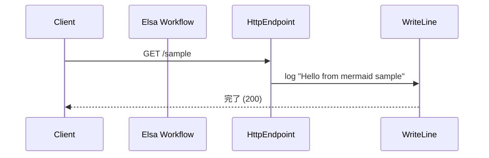

# Elsa Studio でインポートできるワークフロー JSON フォーマット

## 概要
- Elsa Studio はワークフロー定義を JSON 形式でインポートします。
- 推奨スキーマ: `$schema` に `https://elsaworkflows.io/schemas/workflow-definition/v3.0.0/schema.json` を指定。
- スキーマが無い場合も、`definitionId` / `id` / `name` / `root` を含むヘッダ構造であれば簡易検出で受理されます（`CompatWorkflowJsonDetector`）。
- 単一 JSON のほか、複数 JSON をまとめた ZIP もアップロード可能です（ZIP 内の `.json` が順次読み込まれ、入れ子 ZIP も処理されます）。

## 必須フィールド
- `definitionId`: ワークフロー定義 ID。既存定義を上書きする場合は一致させる。
- `id`: バージョン固有の ID。省略時は新規生成されるが、提供しておくと再インポートで同一バージョンとして扱いやすい。
- `name`: 表示名。
- `root`: ルートアクティビティ（例: Flowchart）。アクティビティツリー全体を含む。

## 推奨フィールド
- `$schema`: `https://elsaworkflows.io/schemas/workflow-definition/v3.0.0/schema.json`。
- `createdAt`: ISO 8601 形式の作成日時。
- `version`: 整数の定義バージョン。
- `toolVersion`: ツールバージョン（例: `3.6.0.0`）。
- `variables`: 変数定義配列。`[{ id, name, typeName, isArray, value, storageDriverTypeName }]`。
- `inputs` / `outputs`: 入出力定義。`type`, `name`, `displayName`, `description`, `category` などの `ArgumentDefinition` 派生プロパティを含む。
- `outcomes`: 明示的なアウトカム名の配列。
- `customProperties`: 任意のメタデータ辞書。
- `isReadonly` / `isSystem` / `isLatest` / `isPublished`: ステータスフラグ。
- `options`: `usableAsActivity`, `autoUpdateConsumingWorkflows`, `activityCategory`, `activationStrategyType`, `incidentStrategyType`, `commitStrategyName` などの挙動オプション。

## ルートアクティビティとアクティビティノード
- `root` は通常 `Elsa.Flowchart` などのアクティビティ型オブジェクト。
- 共通プロパティの例:
  - `id` / `nodeId` / `name` / `type` / `version`
  - `customProperties`（例: `canStartWorkflow`, `runAsynchronously`）
  - `metadata`（デザイナー座標など）
  - `activities`: 子アクティビティ配列
  - `variables`: ノードスコープの変数
  - `connections`: `{ source: { activity, port }, target: { activity, port } }` でアクティビティ同士を接続
- 各アクティビティは型ごとに固有プロパティを持ち、`typeName` と `expression` を組にした構造（リテラル値は `expression.type: "Literal"` で `value` を保持）。

## 変数・入出力定義の形
- 変数 (`variables`): `id`, `name`, `typeName`, `isArray`, `value`, `storageDriverTypeName`。
- 入力 (`inputs`) / 出力 (`outputs`): `type` (CLR 型名), `name`, `displayName`, `description`, `category`。入力は追加で `uiHint`, `storageDriverType` を持てる。

## 最小サンプル
```json
{
  "$schema": "https://elsaworkflows.io/schemas/workflow-definition/v3.0.0/schema.json",
  "id": "3b42d3276206e00f",
  "definitionId": "fb27085e78433f79",
  "name": "HttpWorkflow",
  "createdAt": "2025-05-12T12:28:56.845918+00:00",
  "version": 1,
  "toolVersion": "3.5.0.0",
  "variables": [],
  "inputs": [],
  "outputs": [],
  "outcomes": [],
  "customProperties": {},
  "isReadonly": false,
  "isSystem": false,
  "isLatest": true,
  "isPublished": false,
  "options": {
    "autoUpdateConsumingWorkflows": false
  },
  "root": {
    "id": "8163a86bbcff6777",
    "nodeId": "Workflow1:8163a86bbcff6777",
    "name": "Flowchart1",
    "type": "Elsa.Flowchart",
    "version": 1,
    "customProperties": {
      "notFoundConnections": [],
      "canStartWorkflow": false,
      "runAsynchronously": false
    },
    "metadata": {},
    "activities": [
      {
        "path": {
          "typeName": "String",
          "expression": { "type": "Literal", "value": "test" }
        },
        "supportedMethods": {
          "typeName": "List<String>",
          "expression": { "type": "Literal", "value": "[\"GET\"]" }
        },
        "authorize": {
          "typeName": "Boolean",
          "expression": { "type": "Literal", "value": false }
        },
        "policy": { "typeName": "String", "expression": { "type": "Literal" } },
        "id": "b036c71bbd31983d",
        "nodeId": "Workflow1:8163a86bbcff6777:b036c71bbd31983d",
        "name": "HttpEndpoint1",
        "type": "Elsa.HttpEndpoint",
        "version": 1,
        "customProperties": { "canStartWorkflow": true, "runAsynchronously": false },
        "metadata": {
          "designer": { "position": { "x": -180, "y": -80 }, "size": { "width": 173.56, "height": 49.6 } }
        }
      }
    ],
    "variables": [],
    "connections": []
  }
}
```

## 実務上のヒント
- `$schema` を付けると Studio 側で確実にワークフローとして検出されます。
- 再インポートで同じ定義を更新したい場合は `definitionId` を固定し、`isPublished` と `options.autoUpdateConsumingWorkflows` を用途に応じて設定します。
- ZIP に複数 JSON を入れると、一括インポートで順次処理されます。ZIP 内の入れ子 ZIP も展開されます。
- 値はすべて CamelCase でシリアライズされる想定です（Studio のデシリアライザは `PropertyNamingPolicy = JsonNamingPolicy.CamelCase`）。

## Mermaid シーケンスと実装例（標準アクティビティのみ）

### シーケンス図


### インポート可能な JSON
- パス: `doc/qa/samples/mermaid-sequence-sample.json`
- 標準アクティビティのみで構成: `Elsa.HttpEndpoint` → `Elsa.WriteLine`。
- エンドポイント: `GET /sample` にマッピング。

主なフィールド抜粋:
- `$schema`: `https://elsaworkflows.io/schemas/workflow-definition/v3.0.0/schema.json`
- `definitionId`: `f4b6b8e83d8a4b1b`
- `root.type`: `Elsa.Flowchart`
- アクティビティ:
  - `HttpEndpoint1` (`Elsa.HttpEndpoint`): `path = "sample"`, `supportedMethods = ["GET"]`, `canStartWorkflow = true`
  - `WriteLine1` (`Elsa.WriteLine`): `text = "Hello from mermaid sample"`
- コネクション: `HttpEndpoint1.Done -> WriteLine1.In`

そのまま Elsa Studio でインポートすればロード可能です。
