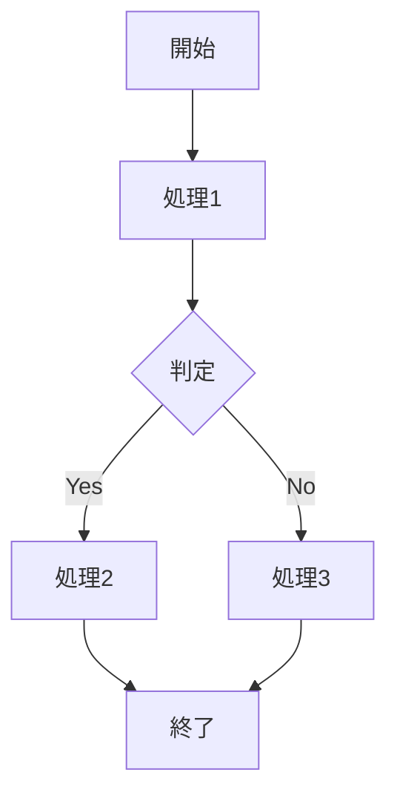
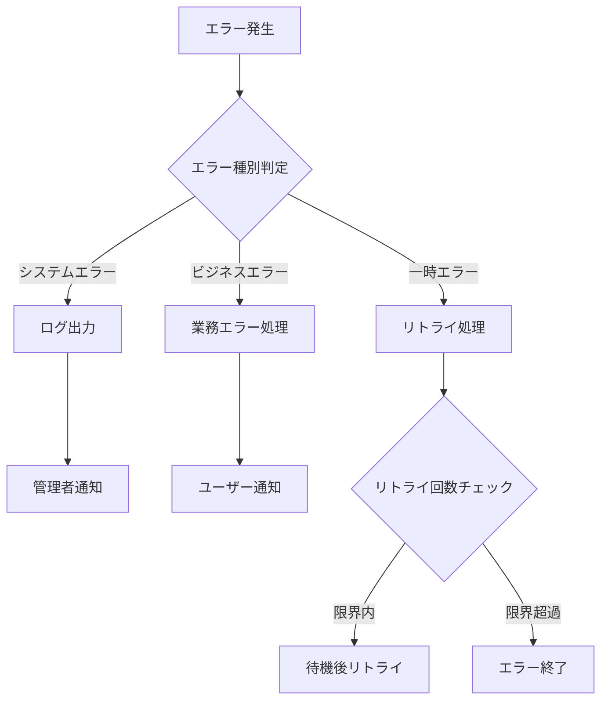

# ワークフロー設計書テンプレート

## 1. 概要

### 1.1 ドキュメント目的
- **設計対象**: [ワークフロー名]
- **目的**: [ワークフローの目的と役割]
- **対象読者**: [想定読者（開発者、運用者、ビジネス担当者など）]
- **関連ドキュメント**: 
  - アクティビティ設計書
  - システムアーキテクチャ設計書
  - API設計書

### 1.2 システム概要
- **システム名**: [対象システム名]
- **Elsaワークフローエンジンの役割**: [システム内でのElsaの位置づけ]
- **全体アーキテクチャとの関係**: [他システムとの関係性]

## 2. ワークフロー要件

### 2.1 ビジネス要件
- **主要機能**: [ワークフローが実現する機能]
- **処理対象**: [処理するデータやイベント]
- **期待される結果**: [ワークフロー完了時の期待値]
- **制約条件**: [ビジネス上の制約]

### 2.2 非機能要件
- **パフォーマンス要件**: 
  - 処理時間: [目標処理時間]
  - スループット: [単位時間当たりの処理量]
  - 同時実行数: [最大同時実行数]
- **可用性要件**: [稼働率目標]
- **スケーラビリティ要件**: [拡張性の要求]

## 3. ワークフロー設計

### 3.1 ワークフロー分類
- **分類**: [イベント処理/バッチ処理/API連携/通知・承認 など]
- **実行モード**: [同期/非同期/スケジュール/イベント駆動]
- **優先度**: [High/Medium/Low]

### 3.2 ワークフロー概要
```
[ワークフローの概要説明]
入力 → [処理ステップ1] → [処理ステップ2] → ... → 出力
```

### 3.3 詳細設計

#### 3.3.1 フローチャート


#### 3.3.2 入力定義
| 項目名 | データ型 | 必須 | デフォルト値 | 説明 |
|--------|----------|------|--------------|------|
| [入力項目1] | [型] | [Yes/No] | [値] | [説明] |
| [入力項目2] | [型] | [Yes/No] | [値] | [説明] |

#### 3.3.3 出力定義
| 項目名 | データ型 | 説明 |
|--------|----------|------|
| [出力項目1] | [型] | [説明] |
| [出力項目2] | [型] | [説明] |

#### 3.3.4 変数定義
| 変数名 | データ型 | スコープ | 説明 |
|--------|----------|----------|------|
| [変数1] | [型] | [Workflow/Activity] | [用途] |
| [変数2] | [型] | [Workflow/Activity] | [用途] |

### 3.4 アクティビティ構成
| ステップ | アクティビティ名 | アクティビティ型 | 設定項目 | 説明 |
|----------|------------------|------------------|----------|------|
| 1 | [アクティビティ1] | [型] | [主要設定] | [役割] |
| 2 | [アクティビティ2] | [型] | [主要設定] | [役割] |

### 3.5 実行条件・トリガー
- **実行トリガー**: [HTTP/Message/Timer/Manual など]
- **実行条件**: [実行開始の条件]
- **実行スケジュール**: [定期実行の場合のスケジュール]

## 4. エラーハンドリング・リトライ戦略

### 4.1 エラー分類
| エラー種別 | 対応方針 | リトライ | フォールバック |
|------------|----------|----------|----------------|
| システムエラー | [対応] | [Yes/No/条件] | [処理] |
| ビジネスエラー | [対応] | [Yes/No/条件] | [処理] |
| 一時エラー | [対応] | [Yes/No/条件] | [処理] |

### 4.2 エラーハンドリングフロー


### 4.3 リトライポリシー
- **リトライ回数**: [最大回数]
- **リトライ間隔**: [間隔設定（固定/指数バックオフ）]
- **リトライ対象エラー**: [リトライする条件]

## 5. パフォーマンス・スケーラビリティ

### 5.1 パフォーマンス設計
- **処理時間目標**: [目標値]
- **スループット目標**: [目標値]
- **ボトルネック分析**: [想定されるボトルネック]
- **最適化ポイント**: [パフォーマンス向上策]

### 5.2 スケーラビリティ設計
- **水平スケーリング**: [スケールアウト方針]
- **ロードバランシング**: [負荷分散方式]
- **リソース管理**: [CPU/メモリ使用量管理]

## 6. データ管理

### 6.1 ワークフロー変数
- **変数スコープ**: [Workflow/Activity レベルの変数管理]
- **データ型定義**: [使用するデータ型と制約]
- **変数ライフサイクル**: [変数の生存期間]

### 6.2 永続化
- **実行状態管理**: [ワークフロー実行状態の保存方式]
- **履歴・ログ管理**: [実行履歴の保存期間と方式]
- **バックアップ・復旧**: [データ保護方式]

## 7. 外部システム連携

### 7.1 連携システム
| システム名 | 連携方式 | 認証方式 | 説明 |
|------------|----------|----------|------|
| [システム1] | [REST/Message/File] | [方式] | [連携内容] |
| [システム2] | [REST/Message/File] | [方式] | [連携内容] |

### 7.2 連携パターン
- **API連携**: [REST API呼び出しパターン]
- **メッセージ連携**: [RabbitMQ等のメッセージングパターン]
- **ファイル連携**: [ファイル転送パターン]

## 8. 監視・運用

### 8.1 監視項目
| 監視項目 | 閾値 | アラート条件 | 対応アクション |
|----------|------|--------------|----------------|
| 実行時間 | [時間] | [条件] | [対応] |
| エラー率 | [%] | [条件] | [対応] |
| キュー滞留 | [件数] | [条件] | [対応] |

### 8.2 運用手順
- **デプロイ手順**: [ワークフローのデプロイ方法]
- **運用監視**: [日常監視項目と手順]
- **トラブルシューティング**: [問題発生時の対応手順]

## 9. テスト計画

### 9.1 テスト観点
- **機能テスト**: [ワークフロー機能の検証項目]
- **性能テスト**: [パフォーマンス検証項目]
- **障害テスト**: [エラーハンドリング検証項目]

### 9.2 テストデータ
- **正常系データ**: [テスト用の正常データ]
- **異常系データ**: [エラーケース用データ]
- **境界値データ**: [境界条件テスト用データ]

## 10. 実装メモ

### 10.1 技術的考慮事項
- **実装上の注意点**: [開発時の注意事項]
- **既知の課題**: [設計上の課題や制約]
- **将来拡張**: [将来的な機能拡張の考慮点]

### 10.2 参考資料
- **関連ドキュメント**: [参照すべきドキュメント]
- **外部リソース**: [参考となる外部資料]
- **サンプルコード**: [実装の参考となるコード例]

---

## テンプレート使用方法

1. **基本情報の記入**: セクション1-2で基本的な情報を記入
2. **要件の明確化**: セクション2で機能・非機能要件を詳細化
3. **設計の詳細化**: セクション3でワークフローの具体的な設計を記述
4. **運用考慮**: セクション4-8で運用に必要な情報を整理
5. **テスト・実装**: セクション9-10で開発・テストに必要な情報を記載

**注意**: このテンプレートをClineへの入力として使用する際は、具体的な値や設計内容を記入してから提供してください。
